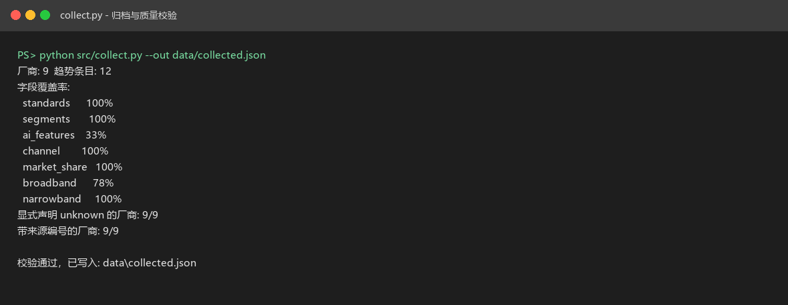
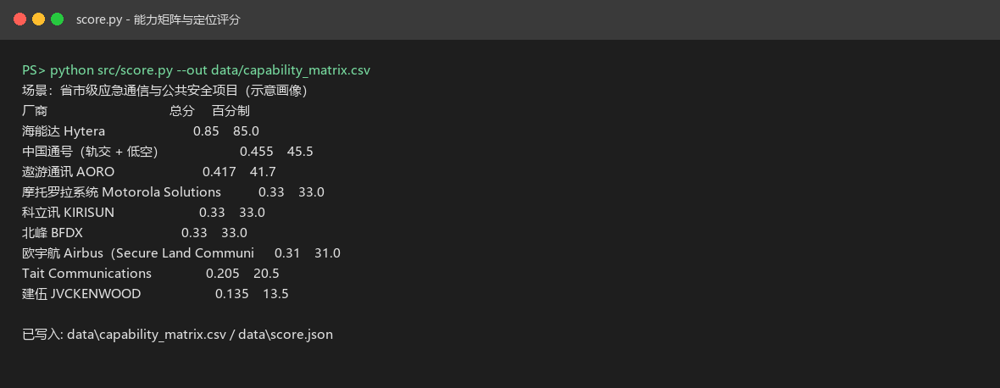
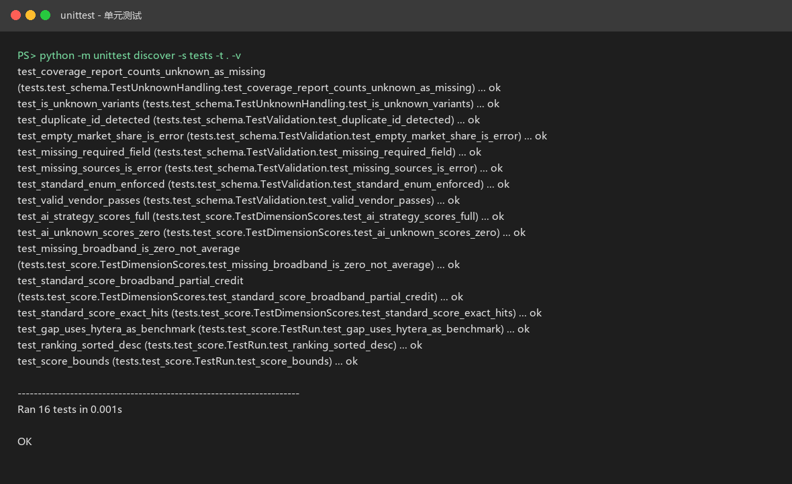
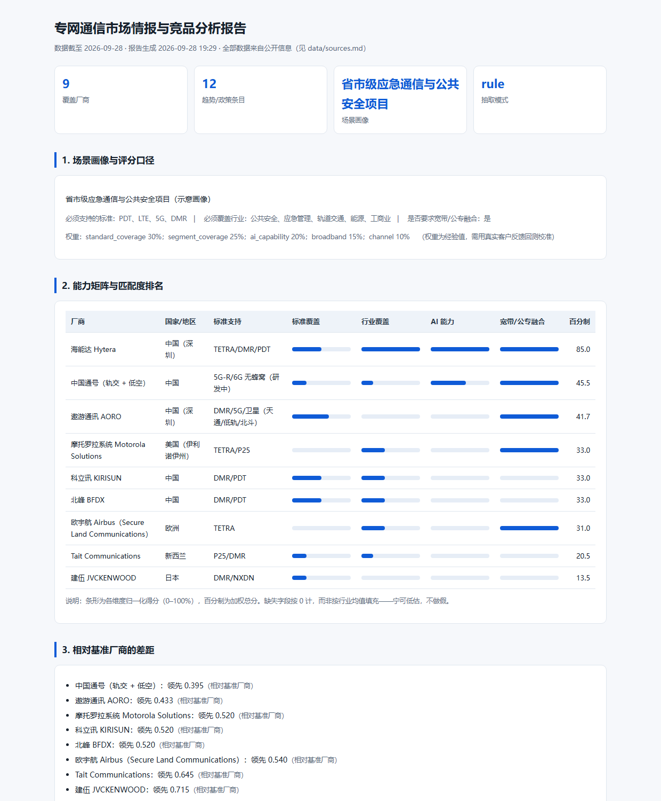

# 专网通信市场情报与竞品分析 POC

> 一句话定位：把"公开渠道散落的产品页、研报、政策文件、招投标公告"，做成一张**可复现、可质疑、可更新**的专网通信厂商能力矩阵，并输出面向产品规划与售前打单的结论。

适用场景：专网通信行业的竞品研究、产品定位与方案支撑。

---

## 1. 为什么做这个

专网通信（专用无线通信）是一个**项目制、招投标驱动**的行业：客户问的不是"你的设备参数多少"，而是"你的方案在'断网断电断路'的时候能不能用、比摩托罗拉便宜多少、能不能对接我已有的 370MHz 应急专网"。

答这类问题需要两样东西：

1. **结构化的竞品事实**——谁支持哪些标准（TETRA / DMR / PDT / P25）、覆盖哪些行业、AI 能力到什么程度、渠道怎么走；
2. **可量化的价值口径**——用一套统一字段对比，而不是各厂商 PPT 里的自说自话。

这个 POC 就是把第 1 件事做成流水线，第 2 件事做成可复算的结论。

## 2. 覆盖哪些问题

| 问题 | 本项目的产出 |
|---|---|
| 竞品能力到底差在哪 | `data/capability_matrix.csv` —— 统一字段的横向矩阵 |
| 行业趋势往哪走 | `docs/industry-trends.md` —— 政策标准 + 技术路线 + 需求结构 |
| 我们的差异化定位是什么 | `docs/product-positioning.md` —— 基于矩阵的定位建议 |
| 怎么把这个结论讲给客户 | `presales/` —— 一页解决方案、Demo 脚本、异议 FAQ、价值测算 |

## 3. 数据源与合规边界

- 数据来源**全部为公开信息**：厂商官网/公开产品页、公开研报摘要、政府与标准组织公开文件、行业媒体报道（清单见 `data/sources.md`，每条带来源与检索日期）。
- **不含**任何客户名单、合同金额、内部报价、未公开的产品路线图或个人数据。
- 示例与截图一律使用公开可引用内容；如需演示，使用脱敏后的样例数据。
- 本仓库是**个人学习与能力证明项目（POC）**，不代表任何厂商官方口径；结论均标注前提与假设。

## 4. 方法（四步流水线）

```text
公开信息  →  结构化(schema 校验)  →  AI/规则抽取与归因  →  矩阵 + 报告 + 售前包
 collect.py      schema.py             extract.py            score.py / report.py
```

1. `collect.py`：读取本地已归档的公开信息（离线优先，保证可复现；在线采集为可选增强）。
2. `schema.py`：把厂商能力统一到固定字段（标准支持、频段、行业覆盖、AI 能力、渠道、市场地位…），字段缺失必须显式标 `unknown`，**不允许猜**。
3. `extract.py`：`--mode rule` 用规则抽取；`--mode llm` 走 OpenAI 兼容接口做规格抽取与差异归因（无 key 时自动降级为 rule）。
4. `score.py` + `report.py`：按"标准覆盖 × 行业覆盖 × AI 能力 × 性价比定位"给出定位评分，输出 CSV 与 HTML 报告。

## 5. 快速开始

```bash
# 零第三方依赖，Python 3.10+ 标准库即可运行
python src/collect.py --out data/collected.json       # 归档公开信息 + 质量校验
python src/extract.py --mode rule                     # 结构化抽取（llm 模式需配置 API key）
python src/score.py --out data/capability_matrix.csv  # 生成能力矩阵与评分
python src/report.py --out report.html                # 生成可演示报告
python -m unittest discover -s tests -t . -v          # 16 个单元测试
```

实测输出（2026-09-28）：

```text
厂商: 9   趋势条目: 12
字段覆盖率: standards 100% / segments 100% / channel 100% / market_share 100%
            ai_features 33%（多数厂商未披露可引用的 AI 能力口径，如实计 0）
显式声明 unknown 的厂商: 9/9    带来源编号的厂商: 9/9
评分（省市级应急通信示意画像）：海能达 85.0 > 中国通号 45.5 > 遨游通讯 41.7 > 摩托罗拉 33.0
单元测试: 16 passed
```

### 运行截图

以下为本机实际运行的输出（原图见 `assets/screenshots/`）：

| 归档与质量校验 | 能力矩阵与评分 |
|---|---|
|  |  |

| 单元测试（16 passed） | 报告页 `report.html` |
|---|---|
|  |  |

## 6. 已知局限

1. 市场份额与营收数据来自公开研报/媒体，**口径与时点不一致**（如 Frost & Sullivan 2022 口径 vs 行业媒体 2026 口径），矩阵中保留"多口径并列 + 来源标注"，不做强行统一。
2. 产品规格以官网公开信息为准，**缺失字段标 `unknown`**，不用推测值填充。
3. 在线采集未接入反爬与频率控制，仅做小规模人工触发采集。
4. 定位评分权重是**经验值**，需要用真实客户反馈回测后校准。

## 7. 参考方法

- 竞品分析方法论：能力矩阵（Capability Matrix）+ 定位图（Positioning Map）
- 标准与政策：PDT（中国警用/应急数字集群）、TETRA、DMR、P25、工业 5G 独立专网相关公开要求
- 情报工程思路：采集 → 结构化 → 抽取 → 打分 → 报告（与本仓库"情报即数据产品"的思路一致）

## 8. 声明

本项目为个人学习与研究用途，非任何厂商官方材料；如需引用，请以 `data/sources.md` 中的原始来源为准。
